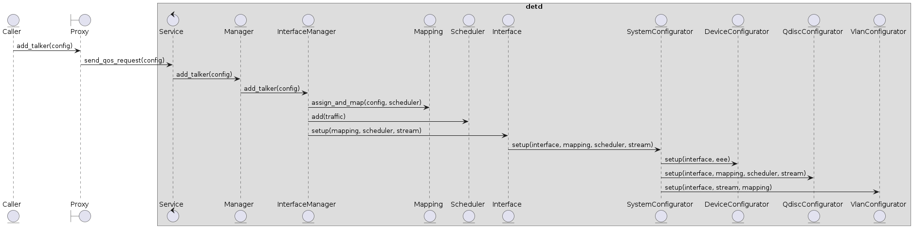

detd Software Documentation
===========================

.. contents:: Table of Contents
   :local:

Architecture
------------

detd is implemented as a daemon and exposes an API for other applications through a Unix Domain Socket.

Usage of detd involves two entities:
   * Server: the detd daemon, referenced as Service in the source code
   * Client: a program that interacts with the detd daemon

The diagram below illustrates a simplified interaction to reserve a talker stream between a client and detd:

   Simplified detd interaction sequence

The steps involved are as follows:

   #. Client request

      #. Client: requests the stream by calling Proxy methods

      #. Proxy: encapsulates the remote process communication transport and interaction

   #. Request processing and routing

      #. Service: accepts and processes the requests

      #. Manager: routes the requests to the right InterfaceManager

   #. Request preparation

      #. InterfaceManager: orchestrates the configuration

      #. Mapping: performs resource management (e.g. queue allocation)

      #. Scheduler: integrates traffic types and streams in a unified schedule

   #. Request execution

      #. Interface: interacts with SystemConfigurator to execute the actual configuration

      #. SystemConfigurator: provides a unified configuration interface for the system

      #. DeviceConfigurator: configures general device settings (e.g. change speed)

      #. QdiscConfigurator: performs the Linux Queuing Discipline configuration

      #. VlanConfigurator: configures VLAN id and priority settings

API Reference
-------------

.. autosummary::
   :toctree: _autosummary
   :recursive:

   detd
